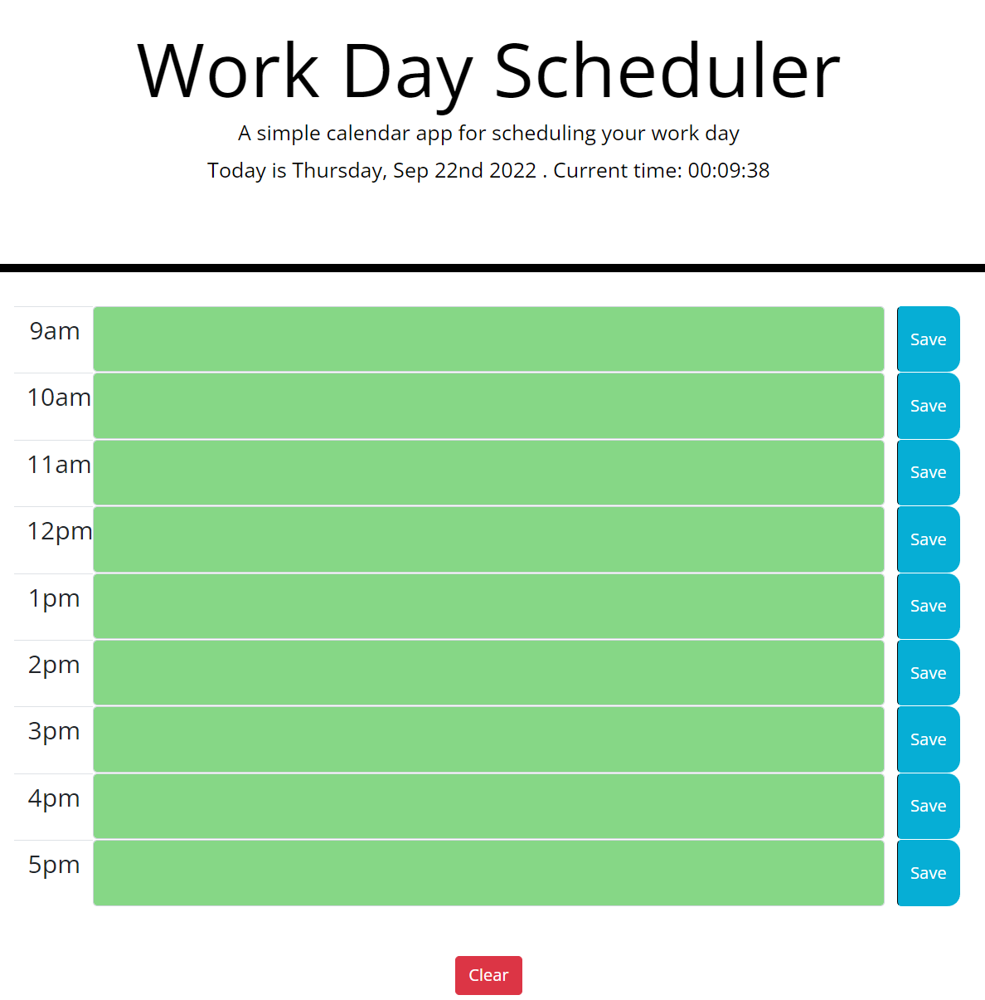
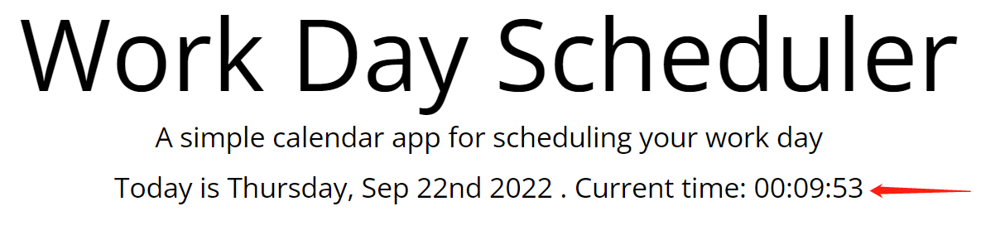
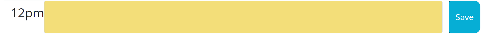
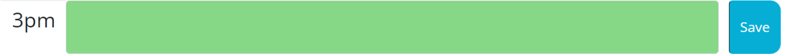
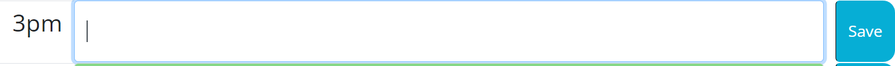
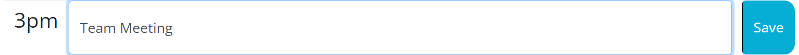
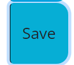
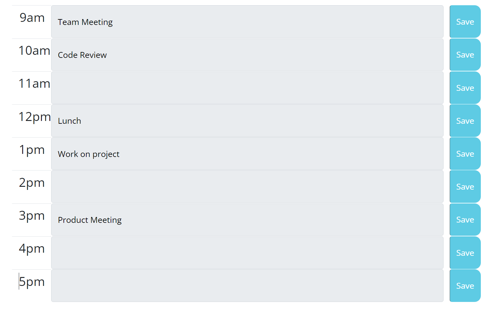
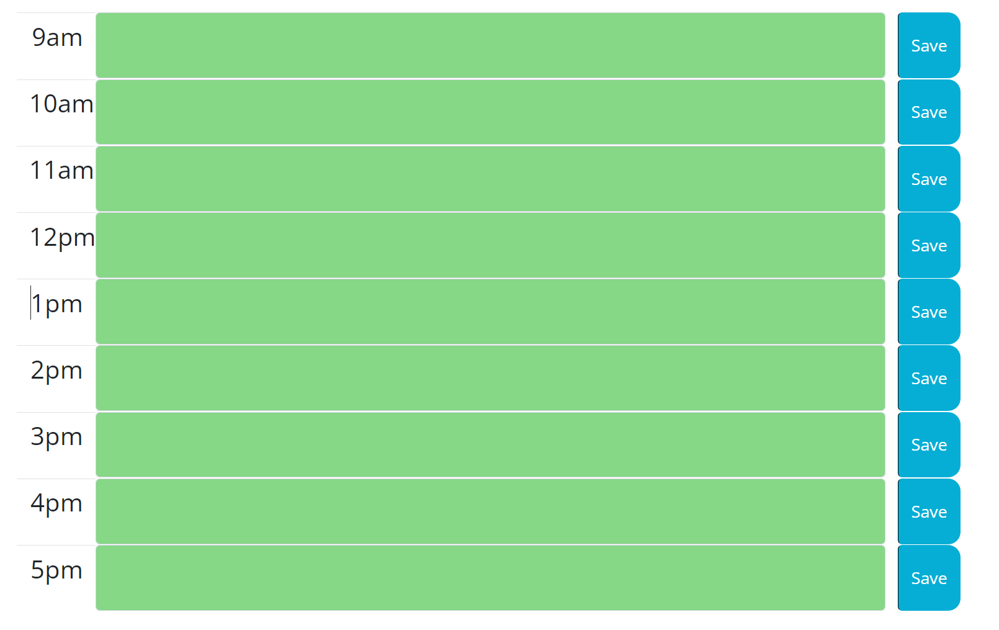
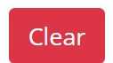

# Daily Event Scheduler

- [Description](#description)
- [Visualization and Usage](#visualization-and-usage)
  - [Overview](#overview)
  - [Schedule a Event](#schedule-a-event)
  - [Clearing the Schedule](#clearing-the-schedule)
- [Contribution](#contribution)
- [License](#license)

## Description

- Daily event scheduler is a web-application developed using jQuery and Bootstrap library.
- It allows user to schedule the event for today's working hours, and also automaticly refreshes when it reaches the next day.

## Visualization and Usage

[View Deployed Project](https://hmhtom.github.io/daily-scheduler/)

### Overview

> Here is the application interface when launched
>
> 

> Current date time information will be shown in the header area
>
> 

> Different colored box in the scheduler shows event in different time
>
> Gray(Disabled) area shows the past event
>
> 

> Yellow area is the current hour
>
> 

> Green area is the future event for today
>
> 

> Scheduler is based on 9-5 working hours

### Schedule a Event

> Click the input box area where you want to schedule your event
>
> 

> Input the event detail
>
> 

> Click SAVE !
>
> 

> Note: Once passed 5pm each day, event scheduler will be disabled, you are not able to change any past events
>
> 

> Once passed midnight, your event scheduler will reset and you can start schedule for your next day's event
>
> 

### Clearing the Schedule

> Scheduler will reset on its own once past midnight, so you don't have to do the reset yourself

> In the case you want to manually reset today's schedule, click the clear button at the very bottom
>
> 

## Contribution

Pull requests are welcome. For major changes, please open an issue first to discuss what you would like to change.

## License

MIT License 

Copyright (c) 2022 hmhtom

Permission is hereby granted, free of charge, to any person obtaining a copy
of this software and associated documentation files (the "Software"), to deal
in the Software without restriction, including without limitation the rights
to use, copy, modify, merge, publish, distribute, sublicense, and/or sell
copies of the Software, and to permit persons to whom the Software is
furnished to do so, subject to the following conditions:

The above copyright notice and this permission notice shall be included in all
copies or substantial portions of the Software.

THE SOFTWARE IS PROVIDED "AS IS", WITHOUT WARRANTY OF ANY KIND, EXPRESS OR
IMPLIED, INCLUDING BUT NOT LIMITED TO THE WARRANTIES OF MERCHANTABILITY,
FITNESS FOR A PARTICULAR PURPOSE AND NONINFRINGEMENT. IN NO EVENT SHALL THE
AUTHORS OR COPYRIGHT HOLDERS BE LIABLE FOR ANY CLAIM, DAMAGES OR OTHER
LIABILITY, WHETHER IN AN ACTION OF CONTRACT, TORT OR OTHERWISE, ARISING FROM,
OUT OF OR IN CONNECTION WITH THE SOFTWARE OR THE USE OR OTHER DEALINGS IN THE
SOFTWARE.
